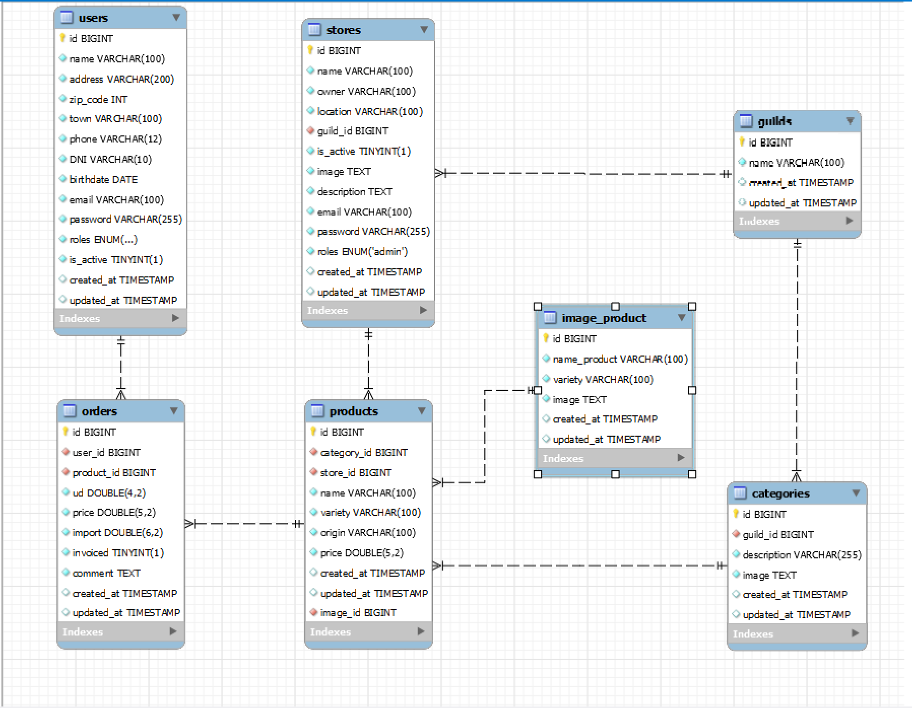

<h1>  E-Commerc para Mercado Municipal  </h1>

**Proyecto Final BACKEND e-commerc de un mercado (Bootcamp Full Stack Developer en GeeksHubs Academy)**

# Tabla de contenidos

-   ### 🚀 [Descripcion](#descripción-del-proyecto)
-   ### 🎯 [Objetivo aplicacion](#objetivo-de-la-aplicación)
-   ### 👩🏽‍💻 [End-points](#end-points)
-   ### 👀 [Diagrama Base de Datos](#diagrama-base-de-datos)
-   ### 🔝 [Mejoras](#futuras-mejoras)
-   ### ⚙️ [Instrucciones aplicación](#instrucciones-de-instalación-local)

# Descripción del Proyecto

Esta aplicación está diseñada para la gestión de compras en un mercado municipal.

Los usuarios deben de registrarse, validando sus datos, incluido el DNI y su fecha de nacimiento, para no registrar DNI falso ni menores de edad.

Los usuarios pueden ver las paradas y su género, y pueden hacer sus compras, generando pedidos que también pueden modificar y borrar.

En esta aplicación no pueden registrarse cualquier vendedor, ya que debe de ser el superAdmin, quien autorice al usuario, cambiando su role, para poder pertenecer a los vendedores del mercado.
El superAdmin, tambien tiene hace la gestión de los gremios y categorias, para así autorizar el tipo de género que se vende en el mercado.

El vendedor puede modificar sus datos, desactivarse en caso de vacaciones, enfermedad, etc, y además crear sus productos.

# Objetivo de la aplicación

-   Registro, login y modificación de datos de usuarios.
-   Crear una cesta de compra, su modificación y eliminación de forma fácil e intuitiva.
-   Funcionalidades adicionales para el admin y superadmin (mejoras).

# Tecnologías

[](https://www.php.net/manual/es/intro-whatis.php)[](https://www.mysql.com/)[](https://laravel.com/)[](https://stackoverflow.com/)[](https://code.visualstudio.com/)[](https://git-scm.com/)[](https://github.com/)[](https://www.thunderclient.com/)[](https://www.postman.com/)[](https://reactjs.org/)[](https://developer.mozilla.org/en-US/docs/Web/JavaScript)[](https://www.openai.com/)[](https://aws.amazon.com/)

</br>

# End-points
<details>
  <summary style="font-weight: bold; font-size: 1.3em;">Endpoints</summary>

##Sin token
-   `Route::post('/register')` Register user.
-   `Route::post('/login')` Login user.
-   `Route::get('/allGuilds')`Muestra todos los gremios`
-   `Route::get('/allStoresByGuild/{id}')`Muestra los vendedores de ese gremio
-    `Route::get('/product/allProductsByStore/{id}')` Muestra todos los productos del vendedor
-    `Route::get('/getImage_productById/{id}')` Devuelve la imagen del producto seleccionado

##Con token
-   `Route::get('/users/profile')` Profile user.
-   `Route::post('/users/logout')` Logout user
-   `Route::put('/users/update')` Update user
-   `Route::put('/users/password')` Update password
-   `Route::put('/users/inactivate')` Inactivate user
-   `Route::post('/stores/register')` Registro del vendedor despues de ser autorizado por el superAdmin, cambiando su role.
-   `Route::get('/stores/profile')` Muestra los datos del vendedor
-   `Route::put('/stores/update')` Modifica los datos del vendedor
-   `Route::post('/product/register')`Crear productos con token vendedor
-    `Route::get('/product/profile/{id}')`Mostrar producto si pertenece al vendedor
-    `Route::delete('/product/delete/{id}')`Eliminar productos que pertenezcan al vendedor logueado
-    `Route::put('/product/update/{id}')`Modificar productos que pertenezcana al vendedor logueado
-    `Route::get('/allCategories')` Mostrar todas las categorias existentes
-    `Route::get('/categories/profileByGuild/{id}')`Muestra las categorias de un gremio
-    `Route::get('/allImage_product',)`Muestra las imágenes de los productos     
-    `Route::post('/order/register')` Crear una orden de pedido
-    `Route::put('/order/update/{id}')`Modificar un pedido
-    `Route::delete('/order/delete/{id}')`Eliminar un pedido
-    `Route::get('/order/basket')`Devuelve todos los pedidos de un user que componen una cesta y no están facturados
-    `Route::post('/confirmBasket')`Confirmación de la cesta, y cambio a estado facturado.

##Con token superAdmin
-   `Route::put('/users/activate/{id}')` Activar un usuario
-   `Route::put('/users/role/{id}')` Cambio de role para poder crear vendedores
-   `Route::get('/allUsers')` Mostrar todos los usuarios
-    `Route::post('/guilds/register')`Crear nuevos gremios
-    `Route::put('/guilds/update/{id})`Modificar los gremios
-    `Route::delete('/guilds/delete/{id})`Eliminar gremios, por si ya no son validos para vender en el mercado, por ej.
-    `Route::post('/categories/register')`Crear categorias
-    `Route::put('/categories/update/{id}')`Modificar categorias
-    `Route::delete('/categories/delete/{id}')`Eliminar categorias
-    `Route::post('/image_product/register')`Crear imágenes de productos.
-    `Route::put('/image_product/update/{id}')`Modificar las imágenes de los productos
-   `Route::delete('/image_product/delete/{id}')`Eliminar imágenes de los productos
</details>


# Diagrama de Base de Datos




# Futuras Mejoras

Este proyecto puede ser mejorado en las siguientes áreas:

-   Me gustaría generar informes para los vendedores, con los pedidos facturados durante un periodo de fechas, para que los vendedores pudieran gestionar sus ventas online.


# Instrucciones de Instalación Local

## Clonar Repositorio

1. Clona este repositorio en tu máquina local usando el siguiente comando:

```jsx
 git clone https://github.com/Noeliamll76/Proyecto-Final-Mercado-backend

```

## Instalación de Dependencias

1. Entra en la carpeta del proyecto:

    ```jsx
    cd nombre_de_la_carpeta

    ```

2. Ejecutar composer php artisan

    ```jsx
    composer install
    php artisan serve
    php artisan migrate
    php artisan db:seed
    ```

## Ejecutar la Aplicación

1. Una vez instaladas las dependencias, inicia la aplicación con el siguiente comando:

    ```bash
    php artisan serve
    ```
Necesitará agregar un `.env` basado en el archivo `.env.example` proporcionando con las credenciales de la base de datos y tener un servidor MySQL en ejecución.


## Contribuciones

Este proyecto es público, y se aceptan las contribuciones para su mejora. Si deseas contribuir, sigue estos pasos:

1. Haz un _fork_ del repositorio.
2. Crea una nueva rama para tu contribución.
3. Realiza tus cambios y mejoras.
4. Envía una _pull request_ para revisión y fusión.

Gracias
